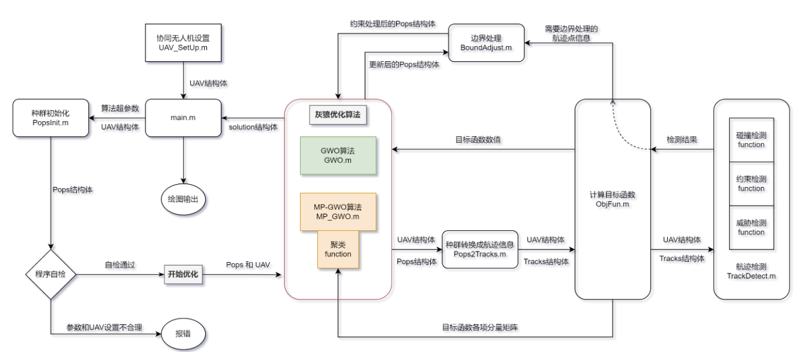
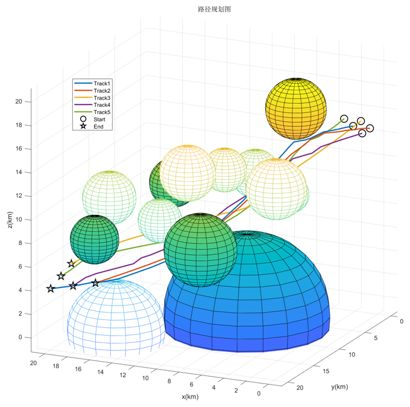
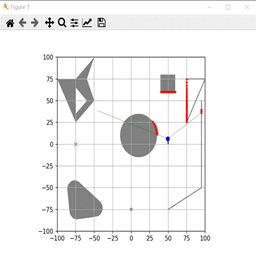

# 灰狼优化算法(GWO)路径规划

# Grey Wolf Optimizer

### 用法：

- matlab运行main.m
- 自带三种UAV_SetUp.m仿真参数设置（也可自行设计仿真环境）
- 同时支持2D无人机轨迹规划和3D无人机轨迹规划（取决于UAV_SetUp.m的参数设置）
- 自带3种启发搜索算法（在main.m中选择）
- 可在ObjFunc.m中调整目标函数权重等
- 程序运行较慢，但有进度条显示，耐心等待

### 程序架构：

### 仿真结果：

### 参考文献：

[1]周瑞,黄长强,魏政磊,赵克新.MP-GWO 算法在多 UCAV 协同航迹规划
中的应用[J].空军工程大学学报(自然科学版),2017,18(05):24-29.

[2]胡中华,赵敏,姚敏,李可现,吴蕊.一种改进蚂蚁算法的无人机多目标三
维航迹规划[J].沈阳工业大学学报,2011,33(05):570-575.

[3]柳长安,王晓鹏,刘春阳,吴华.基于改进灰狼优化算法的无人机三维航迹
规 划 [J]. 华 中 科 技 大 学 学 报 ( 自 然 科 学 版 ),2017,45(10):38-
42.DOI:10.13245/j.hust.171007.

### Requirement:

matlab >= R2021b（没试过低版的matlab）

###### 广告:

###### [DRL-for-Path-Planning: 深度强化学习路径规划， SAC路径规划](https://github.com/zhaohaojie1998/DRL-for-Path-Planning)

###### [Path-Planning: 路径规划算法，A*、Dijstra、Hybrid A*等经典路径规划](https://github.com/zhaohaojie1998/A-Star-for-Path-Planning)

